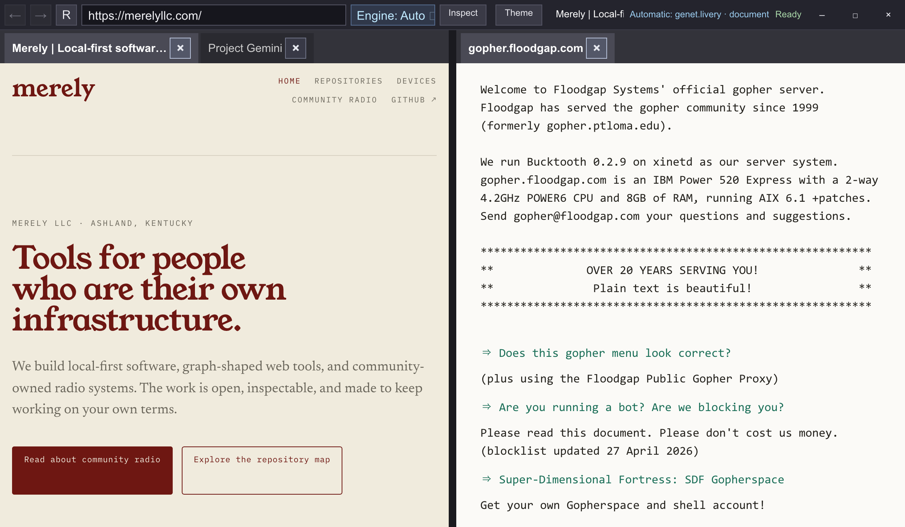
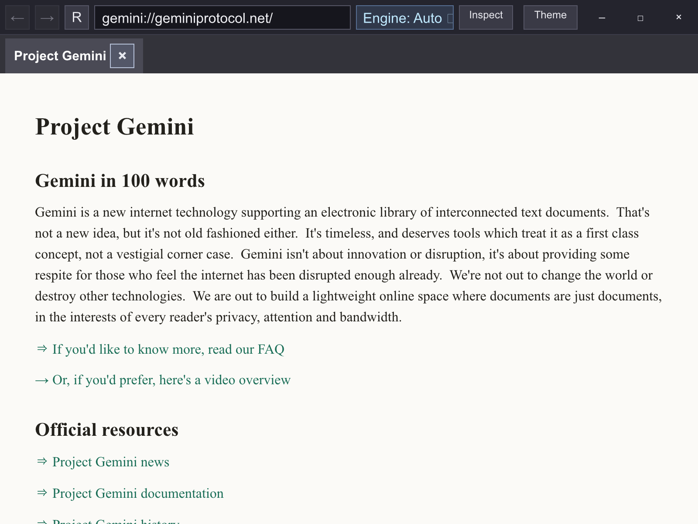
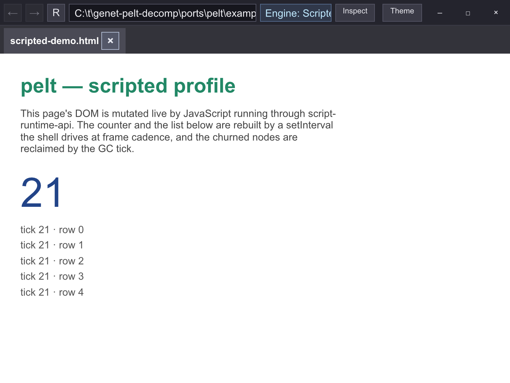
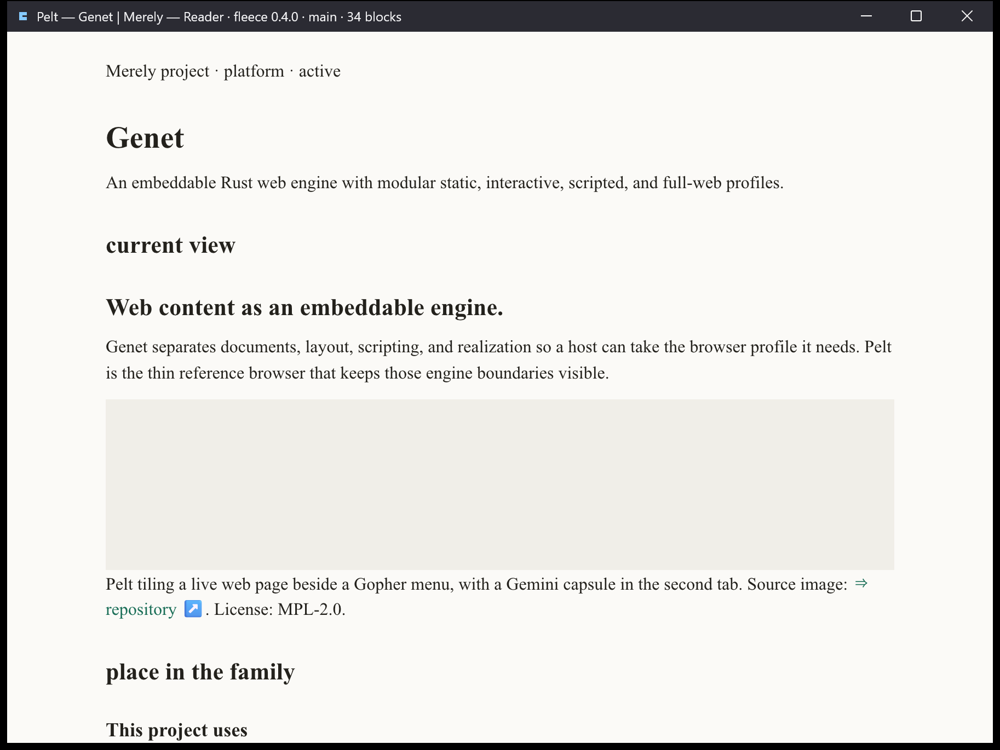
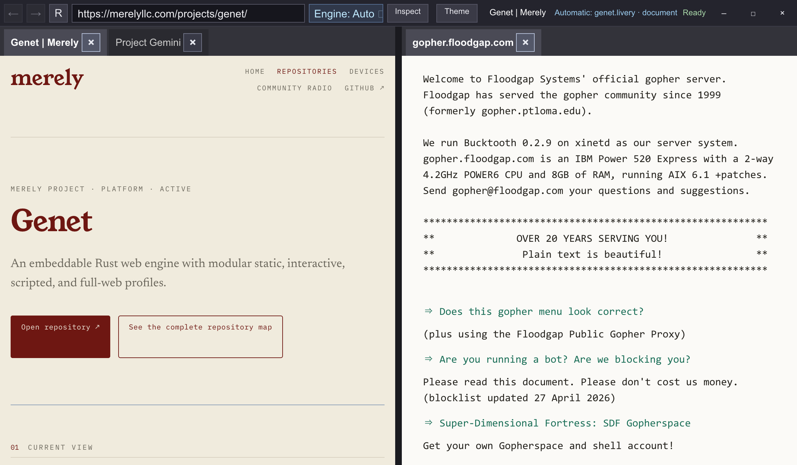

# genet

genet is a prototype web/UI engine derived from [Servo](https://servo.org) and
rebuilt around an owned Rust web stack: Livery for CSS, Buckram for layout,
pluggable script runtimes, and wgpu presentation. Servo remains upstream
reference material rather than a runtime dependency.

<p align="center">
  <br>
  <sub>Pelt, genet's reference browser: a live web page, a Gopher menu, and a Gemini capsule tiled in one workspace under its own client-side-decorated chrome.</sub>
</p>

| | |
|---|---|
|  |  |
| <sub>The smolweb lane: a Gemini capsule as a native document.</sub> | <sub>The scripted profile: a live DOM driven through script-runtime-api.</sub> |
|  |  |
| <sub>Reader: Fleece extracts the article, the tile keeps its held response.</sub> | <sub>The same workspace over the Genet project page.</sub> |

## Status (2026-08-22)

Active prototype. A development monorepo of ~50 crates, all `publish = false`.

- Livery/Buckram is the sole HTML style and layout route. It owns retained
  layout, hit testing, nested scrolling, selection, resources, and scene
  production. Remote http(s) loading is on by default through netfetcher.
- Scripting is an engine-neutral seam with three working backends: Nova
  (primary native), Boa (pure Rust, wasm and conformance oracle), and Piccolo
  (Lua).
- Pelt currently proves the static and scripted Livery routes in a headed
  single-document adapter. Its next lane rebuilds the embeddable, tiled,
  tiered reference host around those engines; see
  `docs/2026-08-22_pelt_host_reconstruction_execution_plan.md`.
- `components/cambium/` is the reactive UI toolkit, including the shared
  desktop host (`cambium-genet-winit-host`) that sibling apps build on.
  Client-side window decorations landed on that host 2026-08-10.
- Consumed one-way as the engine layer by the mere platform workspace and
  the turnstone, isometry, woodshed, and hocket apps. Rendering lowers into
  the sibling [netrender](https://github.com/merely-made/netrender) repo.

Current state and plans are tracked in `docs/`, named by date; the most recent
docs are authoritative.

## Use

Builds with cargo on the pinned toolchain (`rust-toolchain.toml`) on a stock
Windows setup. The default member is `ports/pelt`, the reference browser and
validation viewer.

```sh
cargo build

# Script-free HTML through Livery/Buckram (file://, bare paths, data:, http(s))
cargo run -p pelt -- <url-or-file>

# Scripted profile: run a page's inline <script> and render the mutated DOM
cargo run -p pelt --features scripted -- --engine scripted <file>

# Protocol-native document lane
cargo run -p pelt --features smolweb -- gemini://example.org/
```

`pelt --help` lists the diagnostic engine override and presentation smoke runners.

```sh
cargo test --workspace                 # unit/lib tests
cargo run -p genet-wpt -- run <subset> # WPT crash-smoke, e.g. css/CSS2/floats
```

## License

genet is a derivative of Servo and is licensed under MPL-2.0 (exceptions:
`meristem` Apache-2.0, `sprigging` MIT OR Apache-2.0).

---

*This README was generated by AI and will be edited by the author upon
release.*
